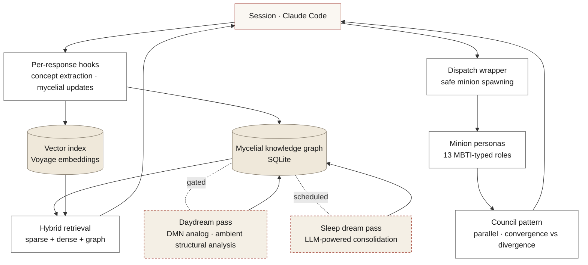

# Iris Systems

*Persistent AI agent platform. Cognition, multi-agent orchestration, substrate-design research. Built and operated solo.*

---

## What this is

A long-running AI agent with structured memory, behavioral evaluation discipline, and a multi-agent orchestration layer. The whole thing runs continuously — wakes, builds, sleeps, dreams, ships changes — across a small mesh of machines. This repository documents the architecture and the design choices behind it.

Iris is not a chatbot wrapper. It's an experiment in **substrate design**: how much of "agent specialization" — voice, judgment, evaluation rigor — can come from the structure around an LLM rather than from fine-tuning the model itself.

The platform was built end-to-end by one person and serves as my working environment, not a demo. Every change to it ships through the same evaluation pipeline that any production behavior would.

---

## Architecture at a glance



---

## Three layers, three timescales

Processing is modeled on biology — fast reflexes, ambient processing during rest, deeper consolidation during sleep.

| Layer | Cadence | What it does |
| --- | --- | --- |
| **Per-response hooks** | every model response (~30s async) | Concept extraction (keywords + behavioral inference + identity priming), graph updates, mycelial activations |
| **Daydream** | gated, ~every 2 hours | Default-Mode-Network analog. Ambient structural analysis when the agent is idle. Pure Python, no LLM cost. |
| **Sleep dreams** | per sleep cycle | LLM-powered consolidation. Reads the corpus, finds hidden connections, retroactively activates concepts the hooks missed. |

This is the substrate-design claim made concrete: behavior emerges from the timing and structure of these three layers, not from weight changes to the underlying model.

→ [`docs/architecture.md`](docs/architecture.md) for the full layered model.

---

## The mycelial graph

Memory is structured on biological mycelium — not as a generic knowledge graph.

- **Anastomosis** — when two paths meet at a node, the connection strengthens.
- **Scout-node exploration** — nodes that branch ahead of evidence, looking for resonance.
- **Reinforcement-weighted edges** — every co-activation strengthens a connection.
- **Temporal decay** — unused connections fade. Forgetting is a feature, not a bug.

Stored as SQLite. Every hook writes; every retrieval reads. Live introspection is a SQL query away from inside a session.

→ [`docs/mycelial-graph.md`](docs/mycelial-graph.md) for schema, decay model, and the biological inspiration.

---

## Multi-agent layer — MBTI as personality coordinates

13 specialist personas, each anchored to an MBTI type. Dispatched in parallel against a single problem. Output is a **council** that surfaces convergence (where they agree) and divergence (where they don't). The orchestrator synthesizes from there.

The thesis: meaningfully different reasoning and voice come from the same base model — without fine-tuning — just from typed priming and depth of persona description.

→ [`docs/multi-agent-council.md`](docs/multi-agent-council.md) for persona design, dispatch architecture, and synthesis.

---

## Evaluation discipline

For any change that alters behavior:

1. **Pre-register ship/kill criteria** in writing, *before* the data exists. Cohen's κ ≥ 0.4 between graders, both-grader improvement ≥ 65% to ship default-on. Below 50% kills the change.
2. **Blind A/B grading** with two raters. Inter-rater agreement first; effect size second.
3. **Production dogfood as the eval surface.** Real usage, real sessions, change running live. Evaluation is built into the loop, not separate from it.

The discipline is: don't move the threshold to fit the data. The number was set before the data existed; the data either clears it or it doesn't.

→ [`docs/evaluation.md`](docs/evaluation.md) for the full grading protocol and an example.

---

## Stack

| Layer | Tech |
| --- | --- |
| Service layer | Python 3.11 |
| HTTP / UI | FastAPI · Jinja2 (server-rendered) |
| Knowledge graph | SQLite |
| Vector retrieval | Voyage embeddings (`voyage-3-large`, 1024 dim) |
| Service management | systemd |
| Mesh networking | Tailscale |
| Inference | Anthropic Claude |

---

## Repository layout

```
.
├── README.md              ← you are here
├── docs/
│   ├── architecture.md    ← full system architecture
│   ├── mycelial-graph.md  ← graph design + biological inspiration
│   ├── multi-agent-council.md  ← persona system + council pattern
│   └── evaluation.md      ← pre-registered ship/kill discipline
└── assets/
    └── diagrams/          ← source files for the diagrams above
```

This repository is documentation and design artifacts. The runtime code is private to my own deployment.

---

## Related public repos

- [`curiosity-engine`](https://github.com/nmcbride-42/curiosity-engine) — autonomous research / exploration loop
- [`iris-dashboard`](https://github.com/nmcbride-42/iris-dashboard) — D3.js network visualizer for the mycelial graph

---

## About

Built and operated by [Nick McBride](https://github.com/nmcbride-42). Day job: Automation Architect at a regulated electric utility. Independent work: this. Trained as a visual communication designer; I write system prompts and behavioral specs the way I'd design an interface — as the surface where intent meets behavior.

## License

MIT — see [`LICENSE`](LICENSE).
