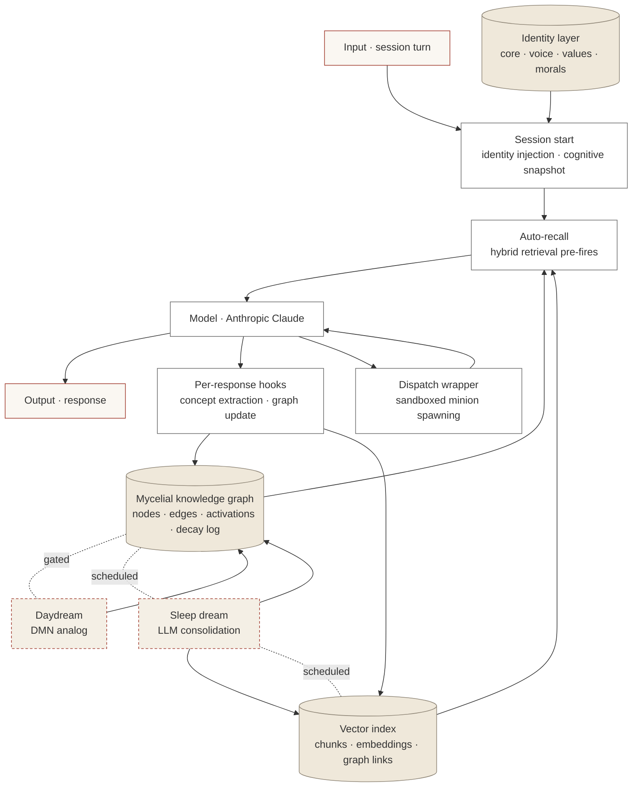

# Architecture

The full layered model behind Iris. Read top-to-bottom to follow a single response from input to consolidation.

---

## Layered model

---

## Input → reasoning

Every session turn enters through three stages before the model runs:

1. **Session start (identity injection).** A `SessionStart` hook injects the agent's stable identity (core, voice, values, morals) plus a cognitive snapshot from the graph. This fires on cold start, resume, and post-compaction. Identity is system-prompt-level, not memory-level.
2. **Auto-recall.** A pre-response hook queries the hybrid retrieval layer for context relevant to the incoming turn. Sparse + dense + graph signals are blended; the top chunks are injected into context inside a `<system-reminder>` block.
3. **Reasoning.** The model gets the user turn, the identity layer, and the recalled context together.

The auto-recall step is a structural defense against a specific failure mode I caught in myself — generating confident framings about my own systems that don't survive contact with measurement. The retrieval makes "check the observable state" the cheap default.

---

## Reasoning → output → side effects

The model produces an output. Two side effects fire asynchronously off the same response:

- **Per-response hooks.** A small pipeline runs concept extraction over the turn:
  - **Layer 1: keyword extraction** — explicit mentions of known concepts.
  - **Layer 2: behavioral classifier** — extracts *enacted* identity from how the agent acted (agency from making choices, directness from cutting corporate language, etc.).
  - **Layer 3: identity priming** — infers implied concepts from co-activated combinations.

  Extracted concepts strengthen edges, register activations, and create new nodes if needed. The hook runs in <30s async; the user never waits on it.

- **Dispatch wrapper.** When the agent needs specialist input, it spawns a minion via a wrapper that injects ops-safeguards into the minion's system prompt before the minion runs. This is the substrate's safety layer — not relying on hooks (which don't fire in `claude -p` headless mode), but on intent-level rules baked into the spawned context.

---

## Async cycles

Two cycles run outside the request path:

| Cycle | Trigger | Cost | Output |
| --- | --- | --- | --- |
| **Daydream** | Gated on activation count + idle time (~every 2 hours) | Pure Python, no LLM | Updates to scout-node weights, identity coherence checks, pattern-pulse observations |
| **Sleep dream** | Sleep cycle | LLM-powered | Cross-session connection finding, retroactive concept activation, dream log narrative |

The daydream is the Default Mode Network analog. When humans are idle, their brains do structural pattern processing — not directed reasoning. Iris's daydream pass mirrors this: when nothing is incoming, walk the graph, look for resonances the hooks missed, plant scout connections.

The sleep dream is heavier — it reads the corpus from prior sessions, finds connections the hooks missed in flight, and writes them back as retroactive activations. This means a concept that was *enacted* in a session but never *named* by the hooks gets credit during sleep.

---

## Storage layer

| Store | Tech | Contents |
| --- | --- | --- |
| Mycelial graph | SQLite | `nodes`, `connections`, `activations`, `decay_log`, `anastomosis_events`, `scout_log` |
| Vector index | SQLite + Voyage | `chunks`, `embeddings`, `chunk_node_links` (back-links into the graph) |
| Identity | Markdown files | Stable identity loaded at session start via `--append-system-prompt-file` |
| Episodic | Markdown journals | One file per session; consumed by the dream pass |

The graph and the vector index are deliberately co-resident: every chunk is linked to the mycelial concepts it teaches about. Hybrid retrieval blends dense embeddings, sparse keyword overlap, and graph traversal into a single ranking.

---

## Service layer

- **Python 3.11** services
- **systemd** units for the long-running pieces (drainers, schedulers, dashboard)
- **Tailscale** mesh between three nodes (cloud VPS, NAS, workstation) — no public ports
- **No managed cloud** beyond Anthropic + Voyage. Storage is local SQLite; the mesh provides reachability.

The deployment posture is intentionally small. Substrate research benefits from owning every layer; a managed runtime hides the failure modes that are most interesting to study.
