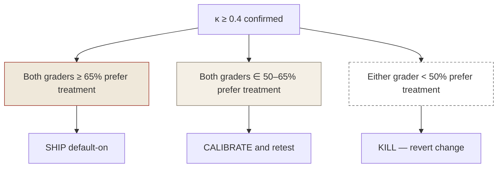

# Evaluation

The discipline that keeps substrate changes honest. Pre-registered ship/kill criteria, blind A/B grading, production dogfood as the eval surface.

---

## The core discipline

> **Set the threshold before you see the data. Don't move it.**

A behavioral change to the substrate (new retrieval strategy, new persona, new hook) is shipped or killed based on a number that was committed to in writing *before* any data exists. The number isn't a goal; it's a contract.

If the data clears the threshold, ship default-on. If it doesn't, the change is killed. There is no "let me re-grade with a different rubric." The rubric was set; the answer is binding.

This sounds rigid. It is. The rigidity is the point. Without it, evaluation degenerates into rationalizing the change you wanted to ship anyway.

---

## Why pre-registration

Two failure modes pre-registration is built to defend against:

- **Threshold drift.** "It's only at 58%, but actually the graders disagreed on a few cases that were close calls — let's say 60% if you exclude those." Now you're picking a threshold to fit the data, not testing whether the change works.
- **Optional stopping.** "Let's run it for another week and see if the trend continues." A change that crosses threshold by random walk is not a change that worked.

Both are well-known in research methodology and both are easy to fall into without a written commitment that predates the data.

The defense: a `[locked]` plan document checked into the repo *before* Phase A starts, naming the metric, the threshold, the n, the kill condition, and the time window. Any change to the document after data starts arriving requires writing a separate amendment with a stated reason. The original numbers stay legible.

---

## Cohen's κ — why agreement comes first

Two graders rate a sample of N outputs (typically 80) under blind A/B conditions: each grader sees pairs of (control, treatment) outputs without knowing which is which. They mark which is better, or "tie."

Before looking at *which side* won, compute Cohen's κ on grader agreement.

| κ | Interpretation | Action |
| --- | --- | --- |
| ≥ 0.4 | Substantial agreement | Continue to effect-size analysis |
| 0.2–0.4 | Fair agreement | Investigate rubric ambiguity |
| < 0.2 | Slight / no agreement | Rubric is broken — re-grade is invalid |

If κ is too low, the answer isn't "ship anyway" or "kill." The answer is **the rubric is unreliable** — you can't tell what the data says. Re-write the rubric, re-grade, or accept that the change can't be evaluated this way.

This step matters because effect size means nothing if graders are noise. A 65% improvement under κ = 0.1 is consistent with the graders being random.

---

## The ship / kill protocol

Once κ ≥ 0.4 is established, look at effect size:

The thresholds are deliberately conservative. 50% is the null. Crossing 50% is necessary but not sufficient. Crossing 65% with both graders independently is the actual bar.

---

## Production dogfood as the eval surface

A common pattern is to evaluate on a held-out test set — a synthetic suite of inputs designed to stress the change. That works for some kinds of evaluation; it doesn't work for behavioral changes to a long-running agent.

Why: a long-running agent's behavior is path-dependent. The retrieval layer's value depends on what's in the graph at the moment of retrieval, which depends on what was extracted by the hooks earlier in the session, which depends on what was said earlier still. A held-out test set with synthetic inputs misses this entire feedback loop.

The substrate eval has to run inside the live loop. Concretely: deploy the change in `dry_run` mode for a calibration window (Phase A), let it accumulate examples from real sessions, then flip to `inject` mode (Phase B) and grade. The grading is on real outputs the agent produced under real load, not on a curated test bench.

This is more expensive and slower. It is also closer to the truth.

---

## Sample structure

A typical eval pass for a substrate change looks like:

| Phase | Duration | What happens |
| --- | --- | --- |
| **Plan** | 1–2 days | Council reviews proposal. Plan locked, threshold pre-registered. |
| **Phase 0 (build)** | 1–2 days | Implementation behind a feature flag, default-off. Unit tests pass. |
| **Phase A (dry-run)** | ~1 week | Change runs in shadow mode — produces output but doesn't influence behavior. Logs events for grading. |
| **Phase B (inject)** | as needed for n=80 | Change is live. Both control and treatment outputs captured under blind labels. |
| **Grading** | ~30 minutes per grader, two graders | Blind A/B over the n=80 sample. κ first, effect size second. |
| **Decision** | one day | Ship default-on, calibrate-and-retest, or kill — per the locked criteria. |

Total wall-clock from plan to decision: about two weeks. Per substrate change. Slower than "ship and watch," meaningfully cheaper than "ship a regression and fix it later."

---

## What this protocol does *not* solve

- **Long-tail behaviors.** n=80 is enough for most substrate changes; it's not enough for catching rare modes. Long-tail surveillance is a separate problem.
- **Cross-change interactions.** Two changes that each pass evaluation in isolation might interact badly when both are live. Periodic full-loop evaluation catches some of this; not all.
- **Ground truth disputes.** "Is this output better?" is a judgment call. Two graders agreeing means the *judgment is reliable*, not that it's *correct*. A consistent grading bias is invisible to κ.

These are open problems. The protocol above is the floor, not the ceiling.
