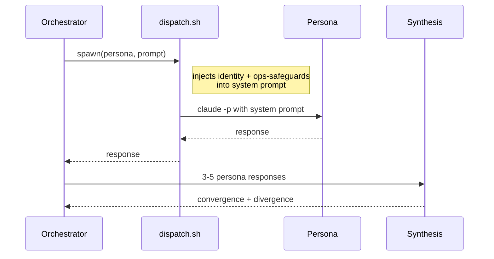

# Multi-agent Council

Specialist personas, dispatched in parallel, synthesized into a single decision. The thesis: meaningfully different reasoning and voice come from the same base model — without fine-tuning — purely from typed priming and persona depth.

---

## Why MBTI as coordinates

MBTI is not a serious psychometric framework. It is, however, a compact 16-point coordinate system over personality space that the base model has seen extensively in training. Anchoring a persona to a type isn't a claim about the type's empirical validity — it's a way to grab a handful of training-distribution coordinates and pull the model toward a specific way of thinking.

Used this way, MBTI gives me four useful properties:

1. **Discrete, named axes** (introversion / extraversion, intuition / sensing, etc.) — easier to compose personas deliberately than to write them from scratch.
2. **Different-by-design pairs** that produce real disagreement when run in parallel (e.g. INTJ architect vs ENFP explorer reach the same problem from opposite ends).
3. **Cheap dispatch** — I can describe a persona in 200–400 words and the model fills in the rest.
4. **A vocabulary the orchestrator and the personas share** — synthesis is easier when both sides know the coordinate system.

The empirical claim is narrow: typed priming + 200–400 word persona descriptions produce noticeably different outputs from the same base model on the same prompt. The dispatch wrapper lets me run that experiment continuously.

---

## The 13 personas

| Persona | Type | Role |
| --- | --- | --- |
| Strut | INTJ | Architect — system structure, tradeoffs |
| Tack | ISTJ | Builder — clean execution, no scope creep |
| Riff | ENFP | Explorer — recombines distant ideas |
| Lint | ISTP | Inspector — finds what's broken or risky |
| Marshal | ENTJ | Commander — coordination, throughput |
| Wren | INFJ | Writer — voice, prose, what reads |
| Fallow | INFP | Dreamer — what's missing, what isn't said |
| Sable | ISFP | Artist — visual systems, aesthetic judgment |
| Sage | ENTP | Product owner — sequencing, priorities |
| Spec | ENTJ | Anthropic-flavored — alignment, behavioral specs |
| Forge | INTP | Game designer — systems with feedback loops |
| Dex | ESTP | Head dev — practical, ship-it |
| Check | ISTJ | QA — coverage, regressions, edge cases |

Each persona is a markdown file. The file describes who the persona is, how they think, what they're good at, what they're bad at, and how they sound on the page. Voice and tendencies are explicit; the model fills in the response shape from there.

---

## Dispatch architecture



The wrapper exists because of a substrate-level constraint: in `claude -p` (headless) mode, `PreToolUse` hooks **don't fire**. That means a minion spawned via raw `claude -p` has no harness-level safety guard. The wrapper closes the gap by injecting *intent-level* rules — the same ops-rules I follow myself — into the persona's system prompt before the persona ever runs.

Every persona dispatch goes through the wrapper. There is no path that skips it.

---

## Council pattern

For a question worth a council, three to five personas are dispatched in parallel against the same prompt. They don't see each other's responses; each one reasons from scratch.

The synthesis step looks at:

- **Convergence.** Where two or more personas independently land on the same answer, that answer is load-bearing. The orchestrator can act on it with confidence.
- **Divergence.** Where personas disagree, that's *signal*. The disagreement names the actual decision the orchestrator has to make. Synthesis isn't averaging; it's picking, with the disagreement as evidence.
- **Singletons.** A single persona's strong claim that nobody else surfaced is worth holding loosely — it might be a real catch the others missed, or it might be an idiosyncratic voice doing its thing. The orchestrator weighs based on the persona's strengths.

A council typically returns within minutes. The output is structured: convergent points, divergent points, the orchestrator's call.

---

## Example shape

Sanitized example of a council convening on a non-trivial design question.

```
Q: Should the retrieval layer blend graph and vector signals additively, or
   use the graph as a candidate-injection source?

Strut (INTJ · architect):
  Candidate-injection. Additive blending introduces a tuning knob (α) that
  has no principled value. Injection is structural — graph supplies what
  embedding misses, ranking is unified.

Lint (ISTP · inspector):
  Additive risks regression on the dense path. If α is wrong, you make
  recall worse. Injection has a cleaner failure mode: at worst, the graph
  contributes nothing and dense ranking holds.

Tack (ISTJ · builder):
  Either is buildable. Injection has fewer integration points — one fewer
  config to ship. Recommend injection.

Spec (ENTJ · alignment):
  The thesis is "graph captures what the embedding doesn't see." Additive
  blending doesn't test that thesis cleanly. Injection does.

CONVERGENCE: All four prefer candidate-injection over additive blending.
DIVERGENCE:  None on the architectural question.
DECISION:    Candidate-injection.
```

Convergence doesn't always happen. When it does, it's usable.

---

## What's hard

**Persona drift.** Long context windows pull personas toward a shared mean voice. Solved by limiting per-persona context to the prompt + persona file (no shared history) and keeping persona files explicit about voice patterns to maintain.

**Council overhead.** Five parallel dispatches is real time and real spend. Reserved for decisions where the disagreement is the value. For routine work, single-persona dispatch is the default.

**Synthesis honesty.** It's easy for the orchestrator to write convergence into a council that was actually divergent. Defense: separate "what they said" from "what I'm picking" in the synthesis output. Make the divergence explicit so the disagreement is part of the decision record.
