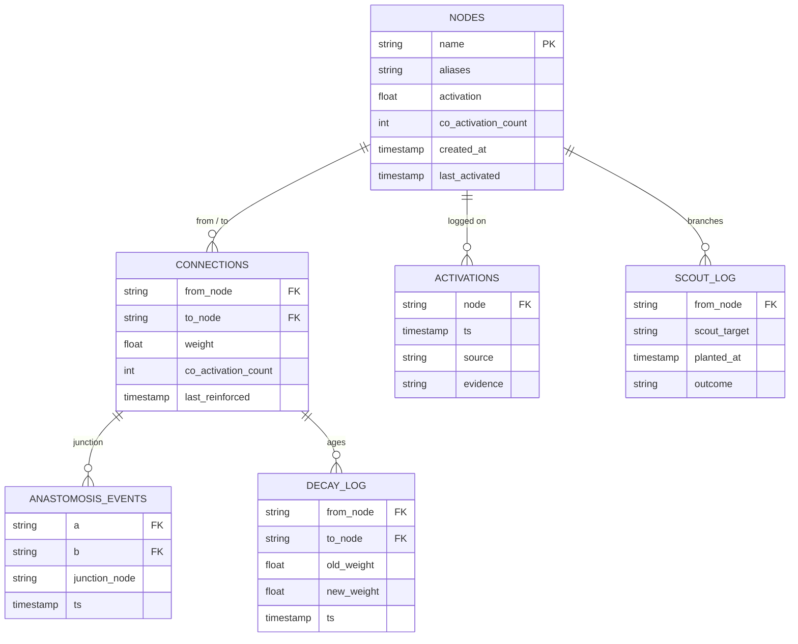

# Mycelial Graph

Why the memory graph is structured on biological mycelium, what that means concretely, and how retrieval traverses it.

---

## Why mycelium

A standard knowledge graph is a static structure: nodes and edges, queried by traversal. It models *what is connected to what*, not *what is currently alive*.

Mycelial networks behave differently:

- They **strengthen** the paths that get used.
- They **weaken** and eventually prune paths that don't.
- Two paths that meet form a junction (**anastomosis**), and that junction becomes a routing hub.
- The network sends out **scouts** — explorations ahead of evidence — that either find resonance and persist, or wither and are reabsorbed.

These are exactly the dynamics I want for a memory layer that has to keep working across thousands of sessions: relevance has to update, irrelevance has to fade, and the structure has to reflect *current* cognition rather than a static snapshot.

The model isn't a metaphor. The schema implements each behavior.

---

## Schema



Live SQLite database. Every per-response hook writes; every retrieval reads. Direct SQL is the supported introspection interface — no ORM hides the structure from the agent.

---

## Edge dynamics

**Reinforcement.** When two nodes co-activate in the same response, the edge between them gains weight. Concretely:

```
new_weight = old_weight * (1 - reinforcement_decay) + 1.0 * reinforcement_decay
```

with `reinforcement_decay` set to keep the system responsive to recent co-activations without erasing established structure. The exact constants are tuned by the eval pipeline (see [`evaluation.md`](evaluation.md)).

**Decay.** Every connection loses a small fraction of its weight on a scheduled tick. Decay is logged so the dream pass can detect *fading* paths — connections that were once strong but are no longer reinforced — and surface them as candidates for either revival (if dream-pass finds new relevance) or pruning.

**Anastomosis.** When a path through the graph crosses a node it hadn't previously, a junction event is logged. Junctions are interesting because they're the structural moment when two previously separate concepts become routable through one another. The dream pass examines anastomosis events for unexpected connections.

**Scout-node exploration.** When the daydream pass finds resonance between two distant concepts, it plants a scout — a tentative edge or a new node — ahead of evidence. Scouts have a short lifespan; they survive only if subsequent activations validate the resonance.

---

## Concept extraction

A response enters; concepts come out. Three layers operate in sequence:

1. **Keyword extraction.** Direct lookup against known node names and aliases. Cheap, precise, low recall.
2. **Behavioral classifier.** Reads the *response* (not just the user input) for *enacted* identity. Examples: "made an explicit choice without asking" → activates `agency`. "Said 'I don't know' without hedging" → activates `directness` and `intellectual-honesty`. This catches identity in action rather than identity in words.
3. **Identity priming.** Infers implied concepts from co-activated combinations. Example: `nick + building → agency`; `honesty + introspection → anti-performance`. A learned mapping from concept clusters to clusters they imply.

The three layers are deliberately asymmetric. Layer 1 catches what's said. Layer 2 catches what's done. Layer 3 catches what's meant.

---

## Hybrid retrieval

The graph alone isn't a retrieval system — it's a structure of relationships. Retrieval combines three signals:

| Signal | What it captures | Source |
| --- | --- | --- |
| **Dense (embedding)** | Semantic similarity to the query | Voyage embeddings over chunked corpus |
| **Sparse (keyword)** | Exact-term overlap | BM25-style scoring with IDF weighting |
| **Graph traversal** | Concept relevance | BFS from query-extracted concepts through reinforced edges |

The blend is candidate-injection, not additive: the graph identifies a candidate set the dense + sparse stack might have missed, then the cross-encoder reranks the union. The graph isn't a tiebreaker on the embedding ranking — it's a *source of candidates* that the embedding ranking didn't surface.

This was the insight that fused two earlier proposals (vector-only retrieval, graph-only retrieval) into one architecture.

---

## What the graph is *not*

- **Not a document store.** Documents live in the chunk index. The graph stores *concepts*; chunks back-link into it via `chunk_node_links`.
- **Not the model's reasoning.** The model reasons; the graph remembers. They're separate layers, joined at the retrieval boundary.
- **Not append-only.** Decay is real. Forgetting is structural. A graph that only grows is a graph that drifts toward noise.
